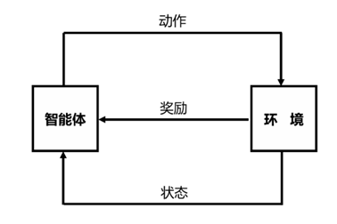
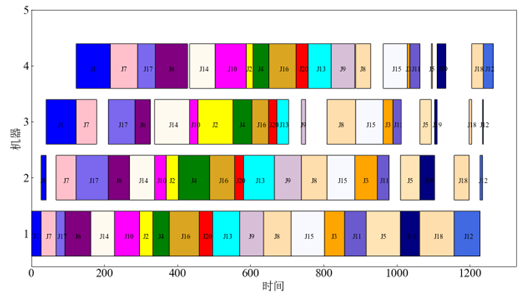

# Scheduling Method Based on Deep Reinforcement Learning and Multi-Glimpse Mechanism

The Flow Shop Scheduling Problem (FSP) is an NP-hard problem, and traditional solution methods are mostly heuristic and metaheuristic algorithms. Although these algorithms are very effective in dealing with complex optimization problems, they usually require careful parameter adjustment and multiple trials to achieve good performance. Moreover, these algorithms usually cannot guarantee finding the global optimal solution, but provide approximate solutions. This paper proposes a method based on deep reinforcement learning and multi-glimpse mechanism to obtain the optimal solution for FSP.

Reinforcement learning is an important branch of machine learning, which mainly focuses on how to take actions in the environment to maximize some cumulative reward [68]. The core idea of reinforcement learning is that the agent learns the best policy through interaction with the environment, that is, the rules for choosing the best action in a given state. The basic components of reinforcement learning are:

1. Agent: The agent is the main body of the learning process, which perceives the state of the environment and executes actions to achieve goals.
2. Environment: The environment is the external world where the agent is located and interacts, which can be the real world or a simulated environment.
3. State: The state is a description of the environment at a certain moment, and the agent decides the next action based on the state.
4. Action: The action is the behavior that the agent can perform in a given state, and the execution of the action will lead to changes in the state of the environment.
5. Reward: The reward is the feedback signal obtained by the agent after executing an action from the environment, indicating the quality of the action or the proximity to the goal.



**Figure 1-1 Reinforcement Learning Schematic**

Deep reinforcement learning is a field that combines deep learning and reinforcement learning. Deep learning is a machine learning method that uses multi-layer (deep) neural networks to learn high-level feature representations of data [69]. Reinforcement learning is a learning paradigm where the agent learns how to make decisions by interacting with the environment to maximize some cumulative reward.

The key components of deep reinforcement learning are:

1. Agent: The agent is the entity that interacts with the environment, learning strategies by executing actions and observing feedback from the environment (such as rewards and new states).
2. Environment: The environment is the external world where the agent is located and interacts. It can be the real world or a simulated world, such as video games or simulation software.
3. Observation: Equivalent to the agent's sensory organs, which obtain initial information from the environment and perform deep learning feature extraction.
4. Action: The action is the behavior that the agent can perform in a given state. The execution of the action will lead to changes in the state of the environment and may bring rewards.
5. Reward: The reward is the feedback signal obtained by the agent after executing an action from the environment, indicating the quality of the action. The goal of the agent is to maximize long-term cumulative rewards.
6. Learning: Learning is to learn patterns from the observed deep neural networks, receive rewards from the environment, and output decisions of reinforcement learning.

 

**Figure 1-2 Deep Reinforcement Learning Schematic**

The Pointer Network is a sequence-to-sequence deep network model based on the idea of directly predicting the elements in the output sequence using a neural network, where these elements are indices of elements in the input sequence, thus achieving a "pointer" function for the input sequence [70]. Using the Pointer Network as the deep network in deep reinforcement learning can be used to solve combinatorial optimization problems with good results [71-72]. This paper refers to the Pointer Network and proposes an improved multi-glimpse mechanism (MGM) method as follows:

Input workpiece data feature enhancement: For each single workpiece in the input workpiece sequence, its mathematical representation is [process_time1, process_time2, process_time3, process_time4], a list of floating-point numbers representing the processing time of the workpiece on four machines. To enrich the input features of each workpiece, this invention uses a feature enhancement method. That is, each workpiece is represented as: [process_time1, process_time2, process_time3, process_time4, ρ, σ], where ρ=atanh (process_time1)/(process_time2) and σ=atanh (process_time3)/(process_time4), expanding from the original 4 features to 6 features.

Input initial embedding: After the feature enhancement of each workpiece, it becomes a 6-dimensional feature, which is multiplied with the embedding matrix for input embedding. A specific embedding matrix with a dimension of input_dim×embedding_dim is defined, input_dim=6, embedding_dim=256. The values of this matrix can be learned through backpropagation to extract high-dimensional feature representations required for the target function.

Encoder: Considering the urgency of the smart production line, a GRU is used for encoding. Since GRU is a simplified version of LSTM, it merges the forgetting gate and input gate of LSTM into a single update gate, and merges the cell state and hidden state into a single state. This means that GRU has fewer parameters and is faster during training. The hidden_dim of the GRU encoder is 256. The context vector e of the input workpiece sequence can be obtained through the encoder.

Decoder: To maintain precision, the decoder first uses an LSTM. This paper uses the multi-glimpse mechanism MGM, and the LSTM outputs the current decoder's hidden state. MGM uses the current decoder's hidden state and context e to iterate a specific number of times through the Attention mechanism, which means that in each decoding process, the decoder can view (or "glimpse") the output of the encoder multiple times to better capture the context information. Specifically:

```
 for i from 0 to n_glimpses - 1:

​		ref, logits = Attention( di , e)

 		di = matrix_multiply(ref, logits)
```

The return value ref of Attention is the product of e and a matrix, represented as W_1^n e, and the matrix is learnable. The return value logits of Attention is the probability of the output workpiece. Finally, an Attention output is used to predict the probability of the next workpiece. The key formula is:


$$
u_i = v^T \tanh(W_1 e + W_2 d_i) \quad \text{式（4-1）}
$$
式（1-1）

​       
$$
[p(C_1) \ldots p(C_j)] = \text{softmax}(u_i) \quad \text{式（4-2）}
$$
 式（1-2）

This represents the input sequence, and represents the probability of the current decoder output as . Where is a learnable parameter, e is the hidden state of the input workpiece sequence after encoding, and is the current decoder's hidden state. Note that the hidden state di is updated n_glimpses times in the multi-glimpse mechanism (MGM). The workpiece with the maximum output probability is then obtained as the current decoder output, and the current decoder state is updated through the LSTM using the masking mechanism MASK to prevent the current output workpiece from being selected repeatedly in subsequent operations. This process is repeated j times to obtain the output workpiece sequence, where j is the number of workpieces. As shown in the following figure is a schematic diagram of the deep network:


**Figure 1-3 Multi-Glimpse Mechanism Deep Network**

In the decoding strategy, two methods are used, one is to select the workpiece with the maximum predicted output probability as the decoder output workpiece, and the other is to select the output sequence with the maximum probability each time, considering the combination probability of the previous workpiece sequence and the current output workpiece.

Since the FSP selects one workpiece with the maximum probability from the input workpiece sequence to the output workpiece sequence each time, and cannot repeat the selected workpiece, this method also adds a MASK vector, whose dimension is the number of input workpieces, with values of 0 or 1. Each time, only the workpiece set corresponding to the MASK value of 0 is selected, and the workpiece with the maximum probability corresponding to the MASK value is updated to 1. Then, the output probability of the remaining workpieces corresponding to the MASK value of 0 is calculated, and this operation is repeated until all workpieces are output. Finally, the reward function is calculated, and the weights of the corresponding networks are updated based on the reward function and historical training information using gradient descent, completing one training from an input workpiece sequence to an output workpiece sequence.

For the input workpiece sequence, it is easy to randomly shuffle the input workpiece sequence to obtain a suitable number of training samples. This method randomly shuffles the input workpiece sequence to obtain 1,000,000 samples, and uses these samples to train the network, eventually allowing the network to converge to a good level. The trained network can then be called for any order of input workpiece sequence, and it can basically output a consistent order of workpiece sequence, thus completing the sorting of the input workpiece sequence, which can be considered as the optimal sorting.

This method maps the input sequence through a deep network to a high-dimensional space to capture features and patterns that are higher-dimensional, less understandable, and difficult to describe with mathematical formulas. Moreover, the reinforcement learning network learns to optimize its decision-making behavior based on these features and patterns, iterating continuously until each action reaches optimality and the output converges. This is manifested by outputting an optimal sorting based on the numerical characteristics of the input sequence.

Due to the customized requirements of this intelligent production line, the processing time of each workpiece on the following four machines is different. One day, the production line received 20 orders.


**Figure 1-4 Production Line Schematic**

The processing times of the 20 workpieces on the four machines are as follows:

**Table 4-3 Processing Times of 20 Workpieces on Four Machines**

| Job_name | M1_processtime/s | M2_processtime/s | M3_processtime/s | M4_processtime/s |
| -------- | ---------------- | ---------------- | ---------------- | ---------------- |
| J1       | 27               | 13               | 83               | 93               |
| J2       | 36               | 33               | 95               | 18               |
| J3       | 55               | 61               | 27               | 7                |
| J4       | 45               | 86               | 52               | 44               |
| J5       | 93               | 54               | 30               | 4                |
| J6       | 71               | 59               | 43               | 88               |
| J7       | 41               | 55               | 56               | 74               |
| J8       | 75               | 69               | 79               | 41               |
| J9       | 65               | 75               | 11               | 65               |
| J10      | 68               | 32               | 23               | 85               |
| J11      | 60               | 32               | 22               | 28               |
| J12      | 71               | 7                | 2                | 27               |
| J13      | 74               | 84               | 32               | 63               |
| J14      | 65               | 68               | 96               | 70               |
| J15      | 91               | 77               | 75               | 66               |
| J16      | 82               | 68               | 45               | 74               |
| J17      | 24               | 87               | 73               | 49               |
| J18      | 94               | 41               | 7                | 32               |
| J19      | 53               | 40               | 6                | 24               |
| J20      | 37               | 24               | 23               | 33               |

Using the data of these 20 workpieces to execute the aforementioned deep reinforcement learning and multi-glimpse mechanism (MGM) algorithm can yield the following results. The action loss of the 20-workpiece deep reinforcement learning and MGM is shown in Figure 4-23, and it can be seen that after a certain number of training iterations, the action loss was reduced to a very low level, 0.00872657.

  

**Figure 1-5 Action Loss of 20 Workpieces with Deep Reinforcement Learning and Multi-Glimpse Mechanism**

The reward function of the 20-workpiece deep reinforcement learning and MGM network, which is the processing time, is shown in Figure 4-24. The actual reward function is the reciprocal of the processing time, and after a certain number of iterations, the processing time converged to 1263 seconds.

  

**Figure 1-6 Processing Time of 20 Workpieces with Deep Reinforcement Learning and Multi-Glimpse Mechanism**

After training, an essentially optimal workpiece scheduling plan can be obtained. The final processing time for the 20 workpieces is 1263 seconds, and the Gantt chart for the schedule can be output as shown in Figure 4-25.



**Figure 1-7 Gantt Chart of 20 Workpieces with Deep Reinforcement Learning and Multi-Glimpse Mechanism**


# 基于深度强化学习和多瞥见机制的调度方法

FSP是一个NP-hard问题，传统的解决方法多为启发式算法和元启发式算法，尽管启发式和元启发式算法在处理复杂优化问题时非常有效，但它们通常需要仔细的参数调整和多次试验，以达到较好的性能。此外，这些算法通常不能保证找到全局最优解，而是提供近似解。本论文提出一种基于深度强化学习和多瞥见机制的方法来得到FSP的最优解。

强化学习是机器学习的一个重要分支，它主要关注如何在环境中采取行动以最大化某种累积奖励[68]。强化学习的核心思想是智能体通过与环境的交互来学习最佳策略，即在给定状态下选择最佳动作的规则。强化学习的基本组成部分：

1. 智能体：智能体是学习过程中的主体，它通过感知环境状态并执行动作来实现目标。

2. 环境：环境是智能体所处和互动的外部世界，它可以是真实世界，也可以是模拟环境。

3. 状态：状态是对环境在某一时刻的描述，智能体根据状态来决定下一步的动作。

4. 动作：动作是智能体在给定状态下可以执行的行为，动作的执行会导致环境状态的变化。

5. 奖励：奖励是智能体执行动作后从环境中获得的反馈信号，它指示动作的好坏或对目标的接近程度。

​                               

图1-1 强化学习示意图

深度强化学习是深度学习和强化学习相结合的一个领域。深度学习是一种机器学习方法，它使用多层（深层）神经网络来学习数据的高层次特征表示[69]。强化学习是一种学习范式，其中智能体通过与环境互动来学习如何做出决策，以最大化某种累积奖励。

深度强化学习的关键组成部分：

1. 智能体：智能体是与环境互动的实体，它通过执行动作并观察环境的反馈（如奖励和新状态）来学习策略。
2. 环境：环境是智能体所处和互动的外部世界。它可以是真实世界，也可以是模拟世界，如视频游戏或仿真软件。
3. 观察：相当于智能体的感知器官，通过这些器官来获取环境的初始信息，并进行深度学习特征提取。
4. 动作：动作是智能体在给定状态下可以执行的行为。动作的执行会导致环境状态的变化，并可能带来奖励。
5. 奖励：奖励是智能体执行动作后从环境中获得的反馈信号，它指示动作的好坏。智能体的目标是最大化长期累积奖励。
6. 学习：学习是从观察的深度神经网络中学习规律，接收环境给予的奖励，并输出强化学习的决策。

 

图1-2 深度强化学习示意图

指针网络是一种基于序列到序列的深度网络模型，它在2015年由Oriol Vinyals等人提出。指针网络的核心思想是利用神经网络直接预测输出序列中的元素，这些元素是输入序列中元素的索引，从而实现对输入序列的“指针”功能[70]。用指针网络作为深度强化学习的深度网络可以用来实现组合优化问题的求解，且有不错的效果[71-72]。本论文参考指针网络并进行改进提出多瞥见机制（MGM）的方法具体如下：

输入工件数据特征增强：对于每一个输入工件序列的单个工件来说，其数学表示为[process_time1, process_time2, process_time3, process_time4],为一浮点数列表，代表该工件分别在4个机器上的加工时间。为了使每个工件输入特征更加丰富多样，本发明使用一种特征增强方法。即将每个工件表示为：[process_time1, process_time2, process_time3, process_time4, ρ,  σ],其中ρ=atanh (process_time1)/(process_time2)、σ=atanh (process_time3)/(process_time4) ，由原来4个特征扩展到6个特征.

输入初始嵌入：每个工件的特征经过特征增强后为6个维度，将这些特征与嵌入矩阵相乘进行输入嵌入。具体定义了一个维度为input_dim×embedding_dim的嵌入矩阵，input_dim=6，embedding_dim=256。并且这个矩阵的数值是可以进行反向传播算法学习的，以提取适应目标函数所需要的高维特征表示。

编码器：考虑到智能产线现场的时间紧迫性，采用一GRU进行编码。由于GRU是LSTM的简化版本，它将LSTM中的遗忘门和输入门合并为一个更新门，并且将细胞状态和隐藏状态合并为一个单一的状态。这意味GRU参数数量较少，因此在训练时更快，GRU编码器的hidden_dim为256。通过编码器即可得到输入工件序列的上下文向量e

解码器：为了保持精度，解码器首先采用一LSTM。本论文采用多瞥见机制MGM，LSTM输出当前解码器的隐藏状态  ，MGM通过多次循环采用Attention机制用当前解码器的隐藏状态  和上下文e迭代特定次数，这意味着在每一步解码过程中，解码器可以多次查看（或“瞥见”）编码器的输出，以更好地捕捉上下文中的信息。具体为：

​        for i from 0 to n_glimpses - 1:   

​			  ref, logits = Attention( di , e)             

​			 di = matrix_multiply(ref, logits)        

其中Attention的返回值ref为e与一矩阵的乘积，表示为 W_1^n e  ,并且该矩阵是可以学习的，Attention的返回值logits为输出工件的概率，最后采用一Attention输出下一个工件的预测概率，重点公式为：
$$
u_i = v^T \tanh(W_1 e + W_2 d_i) \quad \text{式（4-1）}
$$
式（1-1）

​       
$$
[p(C_1) \ldots p(C_j)] = \text{softmax}(u_i) \quad \text{式（4-2）}
$$
 式（1-2）

  表示的是输入序列，  表示的是当前解码器输出为  的概率。其中  是可以学习的参数，e是输入工件序列编码后的隐状态，  是当前解码器的隐状态，注意该隐状态di 多瞥见机制（MGM）里更新了n_glimpses次。之后获取最大输出概率的工件作为当前解码器输出，并通过LSTM更新当前解码器状态  ，采用掩码机制MASK防止当前输出工件在后续操作中重复选择，执行j次即可得到输出工件序列，j为工件个数。如下图所示为深度网络的示意图：

 

图1-3 多瞥见机制深度网络

在解码策略中分别采用了两种方法，一种是选择预测输出概率最大的工件作为解码器输出工件，二是每次选择概率最大的输出序列，这个方法考虑到了前面工件序列和当前输出工件的组合概率。

由于该FSP，每次从输入工件序列中选择一个最大概率的工件到输出工件序列，而不能重复选择选过的工件，故本方法还添加了一个MASK向量，其维度为输入工件个数，值为0或1，每次只选择MASK值为0对应的工件集合中的最大概率所对应的工件，并更新该工件对应的MASK值为1，之后计算剩余MASK为0对应工件的输出概率，重复操作直到所有工件都被输出为止，最后计算奖励函数，同时根据奖励函数和历史训练信息使用梯度下降法更新相应网络的权值，这样就完成了一个输入工件序列到输出工件序列的一次训练。

对于输入工件序列，我们很容易随机打乱输入工件序列，这样就可以得到数量合适的训练样本。本方法随机打乱输入工件序列得到1000000样本，用这些样本训练网络，最终可以使网络收敛到一个不错的水平。后面可以调用该训练后的网络，对于任意顺序输入的工件序列，基本上可以输出一个一致顺序的工件序列，这样就完成了对输入工件序列的排序，且该排序基本上可以认为是最优排序。

本方法将输入序列通过一个深度网络映射到高维空间，以捕获更高维度，更难以理解，难以用数学公式描述的特征及规律，并且强化学习网络根据这些特征规律学习优化自己的决策行为，不断迭代，直到自己的每一步行为达到最优，输出收敛。表现为根据输入序列的数字特征输出一个最优排序。

本智能产线由于定制化的需求，每一个工件在以下4个机器上的加工时间都不同。某天该产线来了20个订单。

 

​                               

图1-4 产线示意图

即20个工件在4个机器上的加工时间如下表：

表4-3 20个工件在4个机器上的加工时间

| Job_name | M1_processtime/s | M2_processtime/s | M3_processtime/s | M4_processtime/s |
| -------- | ---------------- | ---------------- | ---------------- | ---------------- |
| J1       | 27               | 13               | 83               | 93               |
| J2       | 36               | 33               | 95               | 18               |
| J3       | 55               | 61               | 27               | 7                |
| J4       | 45               | 86               | 52               | 44               |
| J5       | 93               | 54               | 30               | 4                |
| J6       | 71               | 59               | 43               | 88               |
| J7       | 41               | 55               | 56               | 74               |
| J8       | 75               | 69               | 79               | 41               |
| J9       | 65               | 75               | 11               | 65               |
| J10      | 68               | 32               | 23               | 85               |
| J11      | 60               | 32               | 22               | 28               |
| J12      | 71               | 7                | 2                | 27               |
| J13      | 74               | 84               | 32               | 63               |
| J14      | 65               | 68               | 96               | 70               |
| J15      | 91               | 77               | 75               | 66               |
| J16      | 82               | 68               | 45               | 74               |
| J17      | 24               | 87               | 73               | 49               |
| J18      | 94               | 41               | 7                | 32               |
| J19      | 53               | 40               | 6                | 24               |
| J20      | 37               | 24               | 23               | 33               |

以该20个工件的数据执行上述深度强化学习和多瞥见机制（MGM）算法可以得到如下结果，20工件深度强化学习和多瞥见机制的动作损失如图4-23所示，可见经过一定次数的训练迭代后，动作损失降到了很低的水平，为0.00872657。

  

图1-5 20工件深度强化学习和多瞥见机制网络的动作损失

20工件深度强化学习和多瞥见机制网络的奖励函数，即为加工时间如图4-24所示，实际奖励函数为加工时间的倒数，一定迭代次数后加工时间收敛到了1263s。

  

图1-6 20工件深度强化学习和多瞥见机制网络的加工时间

训练后即可得到一个基本最优的工件排序调度方案，最终20个工件加工完成时间为1263s，可输出甘特图排程如4-25所示。

 

图1-7 20工件深度强化学习和多瞥见机制网络的排程甘特图
